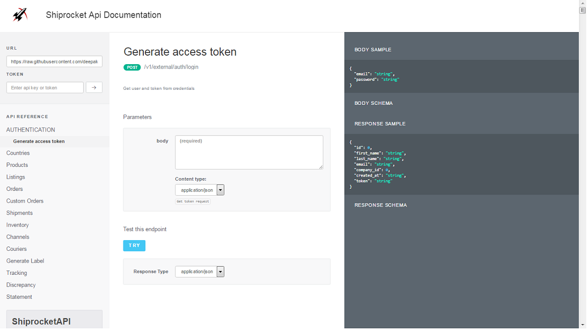
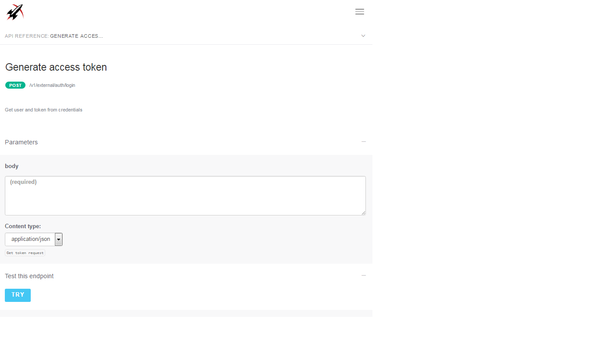
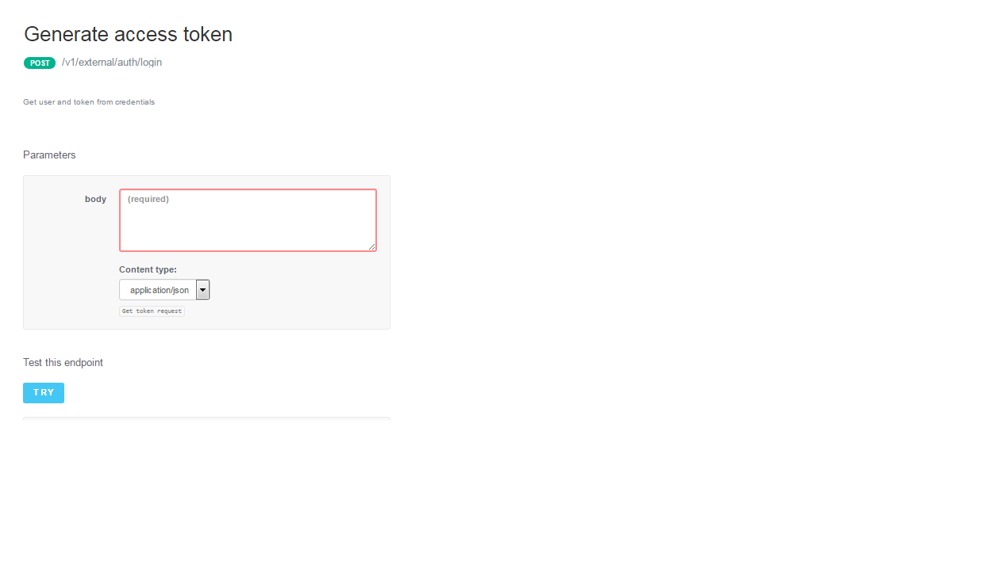

# Swagger
Shiprocket Swagger Api Documentation

[]

The theme will adapt to screen size and works on tablets and mobile phones.

[]

A JSON editor for the request body (disabled by default).



JSON editor configuration example:

```javascript
                jsonEditor: true,
                jsonEditorOptions: {
                    disableProperties:false,
                    disableEditJson:false,
                    removeEmptyProperties:true,
                    noDefaultProperties:true
                },
                docExpansion: "none",
                sorter: "alpha",
```

=======
# Swagger
Shiprocket Swagger Api Documentation
